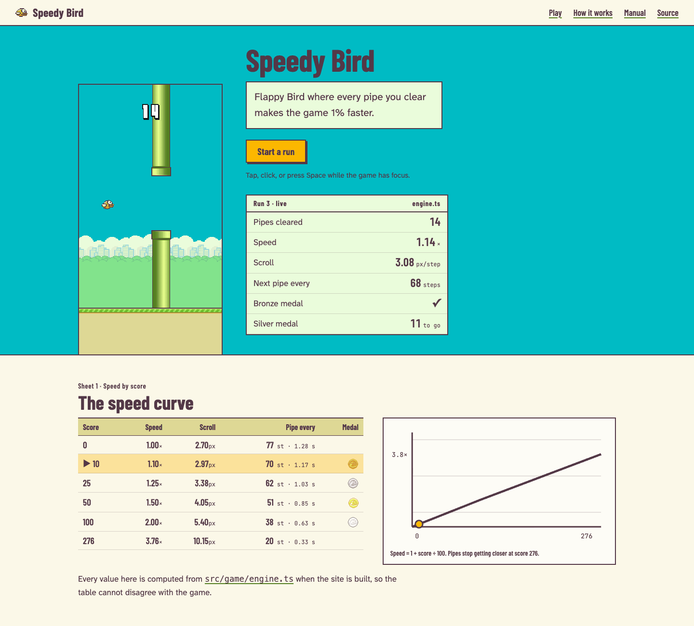

# DESIGN.md

## Status (2026-10-08)

This file describes the website and manual. The previous site (the "night arcade cabinet":
dark navy, glowing stat cards, all-caps buttons, an eyebrow badge over a giant outlined title)
was replaced because it read as a generic generated landing page wearing game colors; it stays
in git history (`git log -p -- DESIGN.md`).

Implemented: tokens and type, the home page (game band, live timing panel, Sheets 1–3, manual
contents, colophon), and the manual layout (numbered contents, page header with documented
sources, typed callouts, ruled tables, code with copy buttons, `/` search, previous/next).
Still to do: the content pass, the 404 scene, and the redrawn Open Graph image (rollout PR D).

## Direction: the timing sheet

Speedy Bird has one idea: every pipe you clear makes the run 1% faster. The site should be
built from the game itself and read like the timing sheet of a race.

- **The game is the hero.** The first screen is the playable level in the game's real
  daytime colors, drawn with its real sprites, not a dark poster about the game. On a phone
  the game is above the fold.
- **Speed is shown as data.** Next to the game, a live timing panel reads the engine state
  every frame: speed multiplier, pipes cleared, distance between pipes, medal progress.
  Further down, the speed curve is a real table and chart computed from
  `src/game/engine.ts` at build time, so it cannot drift from the game.
- **Engineering is shown, not described.** Real excerpts of the source (the main-thread frame
  loop, the bridge contract) are read from the repository at build time. Diagrams show what
  actually runs where.
- **The manual reads like technical regulations:** numbered articles, ruled tables, plain
  sentences, a source link on every page.

This sits next to the other project sites without copying them: Super Mango is built from its
game art, Solar System Simulator is an archival chart, the Blazor sandbox is a lab manual, the
portfolio is a transit map. Speedy Bird is daylight sprites plus race-timing information design.

## Palette

Every color comes from the sprites in `assets/sprites/` (sampled, not invented). Tokens live
once in `docs/src/styles/tokens.css`, written in OKLCH with these sRGB anchors.

| Token | Hex | Source | Use |
|-------|-----|--------|-----|
| `ink` | `#533847` | Outline of every sprite (bird, pipes, ground, titles) | Text, rules, borders, focus rings |
| `paper` | `#FBF8E8` | Ground sand, lightened | Page background |
| `sand` | `#DED895` | Ground strip, game-over panel | Table headers, strips, code background |
| `sky` | `#00BBC4` | Game background (`BG_COLOR`) | The game band only; body text there sits on `cloud` panels |
| `cloud` | `#EAFCDB` | Skyline clouds | Surfaces on sky |
| `grass` | `#73BF2E` | Ground grass | Borders and markers of "Verified" callouts; never text |
| `pipe` | `#557F22` | Pipe body | Link underlines and rule accents; never body text |
| `gold` | `#FCB700` | "Get Ready" / "Game Over" titles | The primary action, the current row in the speed table |
| `flag` | `#FF290C` | Title shadow red | Crash and error markers only; the message text stays `ink` |

Measured contrast (WCAG 2): `ink` on `paper` 9.7:1, on `cloud` 9.6:1, on `sand` 7.1:1, on
`gold` 5.9:1 (the primary button), on `sky` 4.4:1 (large headings only). `pipe` on `paper` is
4.4:1 and `flag` 3.5:1, so neither carries body text; `grass` (2.1:1) is decoration. Links are
`ink` with a `pipe` underline.

There is no dark navy and no glow. A dark scheme can follow later, derived from `ink`
(background) and `paper` (text), behind `prefers-color-scheme`. Every text pair must pass
WCAG AA; input borders and focus rings must reach 3:1.

## Typography

All fonts are self-hosted through `@fontsource`, never requested from a third party.

- **Barlow Condensed** (600/700) for headings, the timing panel, and table figures. It has
  the narrow, tabular look of a timing board. Headings are sentence case.
- **Atkinson Hyperlegible Next** for reading text.
- **JetBrains Mono** for code, file paths, and units in tables.
- The game's own digit sprites (`assets/sprites/digits/`) for the live score only.

Numbers are always tabular (`font-variant-numeric: tabular-nums`). Space Grotesk, Nunito, and
Inter are removed.

## Devices

- **Timing panel:** a ruled, two-column readout (label, value) with condensed tabular numbers,
  like a lap timer. Values update from the engine; labels never change.
- **Sheets:** figures and tables are captioned "Sheet 1 · Speed by score" and numbered across
  the page.
- **Ruled tables:** a 2px `ink` rule above the header, hairlines between rows, units in mono.
  The current row is marked in `gold`, not by color alone (also a "▶" marker in text).
- **Sprite marks:** the manual's sections use real sprites as small marks (bird, pipe mouth,
  the four medals), at integer scale with `image-rendering: pixelated`.
- **Ground strip:** the real ground tile, scrolling only inside the game band, is the
  divider between the game and the page. It stops for `prefers-reduced-motion`.
- **Corners and shadows:** square corners, 2px `ink` borders; at most one solid offset shadow
  (2px, `ink`) on the primary button. No blur, no gradients.
- **Links:** `ink` text with a `pipe` underline, always visible; the underline thickens on hover.

### Remove

Eyebrow badges, stat cards ("1.00× / +1% / 100", "9 manual pages"), all-caps buttons and
navigation, glows and radial gradients, decorative clouds and parallax ornaments, scroll-reveal
animations, icon or emoji feature cards, the "What is Lynx?" sales block on the home page (it
becomes manual content), and in-world labels such as "Night arcade cabinet", "Builder's manual"
and "Service manual". Rule: if a section could appear on any developer landing page after a
color change, rewrite it.

## Home page

1. **Top bar.** Wordmark "Speedy Bird" in Barlow Condensed with a 16px bird sprite. Links:
   Play, How it works, Manual, Source. No hamburger at ≥768px.
2. **Game band.** Sky-colored band containing the playable game (the Canvas build that already
   shares `src/game/engine.ts`) at its 400x750 aspect, with the live timing panel beside it on
   wide screens and below it on phones. One sentence under the title: "Flappy Bird where every
   pipe you clear makes the game 1% faster." Primary button: "Start a run" (gold, sentence
   case). Controls are stated once, next to the game. The ground strip closes the band.
   On phones the title, one-line pitch and button form a single compact row above the game
   (the game must be fully visible at 390x844 without scrolling), and the timing panel moves
   below the band.
3. **The speed curve (Sheet 1).** A table generated at build time from `speedMultiplier`,
   `spawnInterval`, `PIPE_DX` and the medal thresholds, for scores 0, 10, 25, 50, 100, 200 and
   the score where spawning hits its 20-step floor: speed, pixels per step, steps and seconds
   between pipes, medal. A small SVG line chart of the same data. Two sentences on why the
   curve is linear and where it stops getting denser.
4. **One bundle, three hosts (Sheet 2).** A diagram: `main.lynx.bundle` → Android (Kotlin,
   SoundPool), iOS (Swift, AVAudioPlayer), Web (`<lynx-view>`, Web Audio). Under it, the
   `SpeedyBirdModule` contract as a table: method, Android, iOS, Web.
5. **What runs where (Sheet 3).** Main thread and background thread side by side, with the
   real `frame()` excerpt from `src/hooks/useGame.ts` (read at build time between
   `// #region frame-loop` markers) and three annotations: steps, styles, publish.
6. **Manual contents.** A numbered list (not cards), generated from
   `docs/src/lib/docs-sidebar.config.ts`, with one line per guide.
7. **Colophon.** Versions read from `package.json` and the native build files at build time
   (ReactLynx, Rspeedy, Lynx SDK), credits (Flappy Bird by Dong Nguyen; sprite sources),
   license, source link.

The consent banner keeps its behavior and adopts the new tokens (paper sheet, ink border,
sentence-case buttons).

The ground strip under the game band is a static row of the real ground tile; only the game
itself moves on the page.

## Manual

- **Layout:** numbered contents on the left ("1 Start · 1.1 Getting started"), the article
  at a 68-character measure, "On this page" on the right at ≥1200px, previous/next at the end.
  On phones the contents collapse behind a native `
` disclosure.
- **Page header:** article number, title, one-sentence summary, and the source files the page
  documents (linked; a missing path fails the build). No hero panel, no stat cards. A "last
  reviewed" date is not shown: the Pages build uses a shallow clone, so git dates would be wrong.
- **Callouts:** three typed notes with a text label (never color alone): *Note*, *Hold*
  (a dependency held back, with the reason), *Verified* (what was run, on what, when).
- **Code:** paper code blocks with an `ink` border, a file path caption, and a copy button.
- **Search:** a quiet input at the top of the contents, focused with `/`.
- **Docs home:** the contents page itself, plus a short "Start here" path: play, run it
  locally, read the engine, build a host.

## Voice

First person and specific: what the game does, why it was built this way, what was measured.
Sentence case everywhere. No marketing verbs, no "seamless", no "blazing". Numbers come from
the code or from a measurement, and say which.

## Engineering notes

- `docs/src/lib/game-facts.ts` imports `src/constants.ts` and `src/game/engine.ts` to compute
  the speed table at build time.
- `docs/src/lib/source-excerpt.ts` reads a region between `// #region <name>` and
  `// #endregion` markers; `check-site.mjs` fails if a referenced region is missing.
- Versions in the colophon come from `package.json`, `android/gradle/libs.versions.toml` and
  `ios/Podfile.lock`, so they cannot go stale.
- The timing panel subscribes to the Canvas controller's state (score, speed, pipes, medal);
  it adds no second game loop.

## Mockup

`design/mockups/home-desktop.png` and `design/mockups/home-mobile.png` are a static mockup of
the game band and Sheet 1 built with the real sprites, palette, and fonts above. They show
the direction, not final spacing.

## Rollout

PRs A–C shipped together (restyling the old pages first would have been thrown away);
Lighthouse on the built site: performance 97–98, accessibility, best practices and SEO 100.

| PR | Scope | Done when |
|----|-------|-----------|
| A · Tokens and type | New `tokens.css`, fonts, palette; strip glows, gradients, eyebrows, stat cards, all-caps; buttons and links restyled | Both sites render in the new palette with no layout change; contrast checks pass |
| B · Home page | Game band with live timing panel, speed curve sheet, hosts sheet, threads sheet with source excerpt, manual contents, colophon | Game above the fold at 390x844; sheets generated at build time; e2e suite passes |
| C · Manual | Contents/article/on-this-page layout, page headers, typed callouts, ruled tables, code blocks, `/` search | Every guide has one H1, numbered contents, prev/next; `check-site` passes |
| D · Content and extras | Voice pass on all wiki pages and README, 404 scene (the bird hits a pipe, real sprites), Open Graph image redrawn in the new style | Copy review against the Voice rules; OG image under 100 KB |

Each PR is checked at 390, 768, 1280 and 1440 px against this file, with Lighthouse
accessibility at 100 and performance at 95 or above, no third-party requests (analytics only
after consent), and `prefers-reduced-motion` stopping everything except the game itself.
